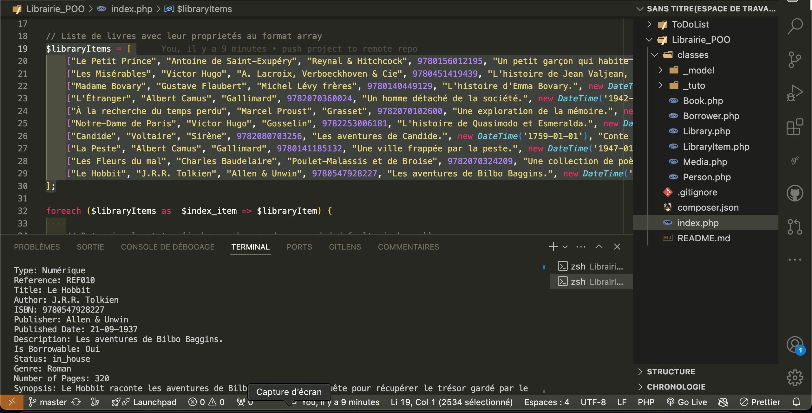
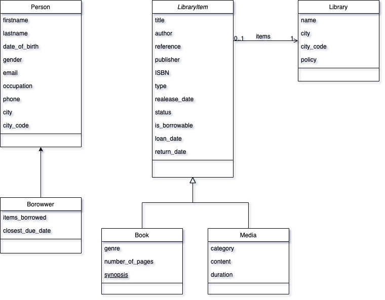

###Application de Bibliothèque et Gestion de Livres

##Description

L'application de Bibliothèque et Gestion de Livres est une application web développée en PHP orienté objet, permettant aux laibrairies de gérer une collection de livres a emprunter ou a consulter sur place. Les utilisateurs peuvent ajouter, modifier, supprimer et consulter les détails des livres.

##To Do
- Conception du MCD, MLD, et MPD (MERISE)
- Création du MVC du CRUD 'Affichage, Insertion, Mise à jour, Suppression)
- Pour tester les classes un tableau associatif contenant les inforlatiosn basés sur les propriétes des classes. 

....

##Technologies Utilisées
- PHP (Programmation Orientée Objet) : Pour la logique côté serveur.
- HTML/CSS : Pour la structure et le design des pages web.
- MySQL : Pour la gestion de la base de données.

##Fonctionnalités Principales
- Tableau de bord : Présente un aperçu des livres disponibles.
- Ajout de livre : Permet aux utilisateurs d'ajouter de nouveaux livres avec des titres, auteurs, éditeurs, ISBN, descriptions, dates de publication, genres, nombres de pages et résumés.
- Modification de livre : Permet de mettre à jour les détails des livres existants.
- Suppression de livre : Permet de supprimer les livres qui ne sont plus nécessaires.
- Consultation de livre : Permet de consulter les informations détaillées sur chaque livre.

## Structure du Projet
```
Library/
        ├── classes
        ├── index.php
      
```
 </img>

 </img>
